I'm assuming you've written a Clojure web app and you want to get it into production with a minimum of pain, expense and "incidental complexity". You don't want DevOps to suck up your time. You'd rather spend your time coding or lying in a hammock thinking about your next Clojure project. 

This post is NOT for you if you're a command line purist or someone who wants fine level control over every detail of your server.

<br>

## Clojure web app hosting

We're going to use a PaaS called [Jelastic](https://jelastic.com/paas-cloud-hosting/), which stands for "Java Elastic Cloud". 

Here's what I like about Jelastic:


*   All the DevOps are taken care of for you. You just make your Uberjar and upload it. 
*   It's free for apps with small RAM & CPU usage. You can spin up new servers for hobby projects without worrying about the expense.
*   Automatic vertical scaling (RAM & CPU) and horizontal scaling (multiple servers) means that if your app gets traction it will be able to cope with the load.
*   You pay only for what you use. If your app is mostly idle 95% of the time and has a huge load for 5% of the time, you only pay for the 5% of the time that you're using RAM/CPU/bandwidth.
*   It's been around since 2011, so it's hopefully going to be around for a while longer.

Also, it comes with the [blessing of James Gosling](https://www.youtube.com/watch?v=GEwnMuIlwN8) (the father of Java), which seems like a pretty strong endorsement. He's actually on the [advisory team](https://jelastic.com/blog/java-rock-stars-james-gosling-and-bruno-souza-join-the-jelastic-team/).

Jelastic is not tied to any one hosting provider. It's a sort of virtualisation layer that lots of different hosting providers use. So, really you're using Jelastic +  Hosting Provider. 

I personally use [MIRhosting](https://mirhosting.com/en/cloud), because they have a generous free level in their plan, but you can choose from [dozens of different Jelastic hosting providers](https://jelastic.cloud/). They all have slightly different pricing. 

<br>

## Step by step (should take 15 min)


### Create an account

Sign up for the 2 weeks free trial at [MIRhosting](https://mirhosting.com/en/cloud) (they offer Jelastic PaaS). You don't need to enter any payment details to try it out. 

Confirm your email address and sign into the MIRcloud dashboard. 


### Create a Java environment

Click the "NEW ENVIRONMENT" button near the top-left of the dashboard. 

Choose Java. 
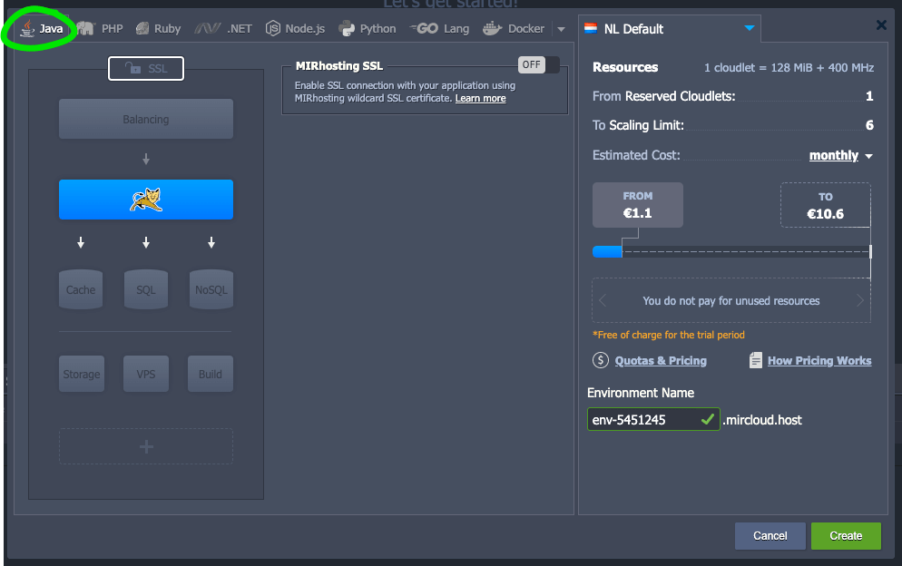
<br>


Click the SSL icon and enable SSL
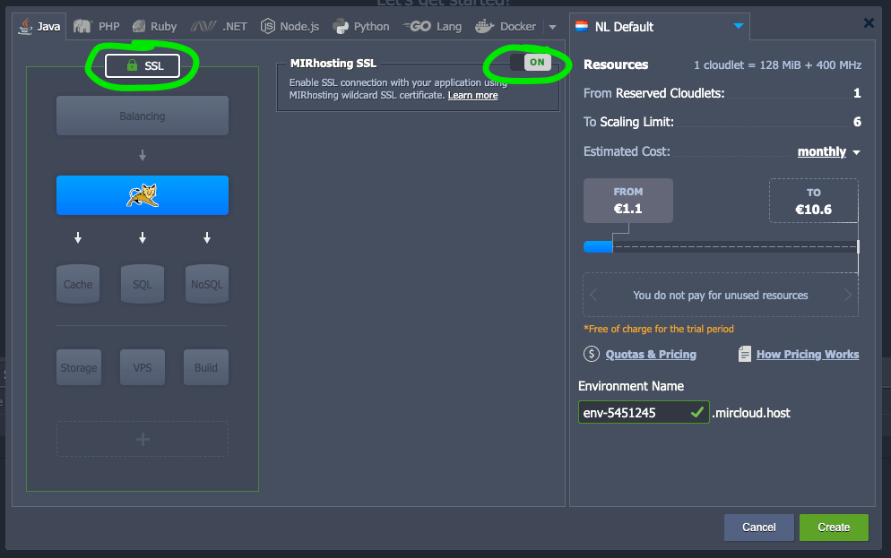
<br>


Click the Application Server button, which presently shows a picture of a cat (for Tomcat). From the dropdown menu choose "Java Engine"
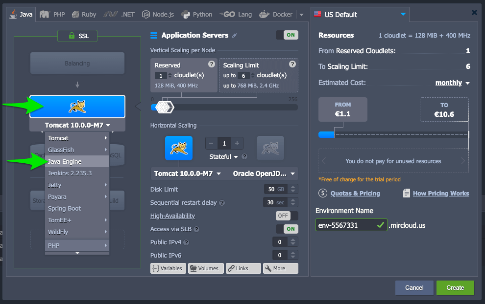
<br>


Click the dropdown menu next to "Oracle OpenJDK" and choose Eclipse OpenJ9 | 0.20.0-11.07, assuming you want to use Java 11. If you want to use Java 8 then choose Eclipse OpenJ9 | 0.20.0-8u252-b09. I recommend using OpenJ9 because it uses [less RAM than other JDK implementations](https://www.royvanrijn.com/blog/2018/05/openj9-jvm-shootout/), which means your hosting bill will be cheaper (or free). 
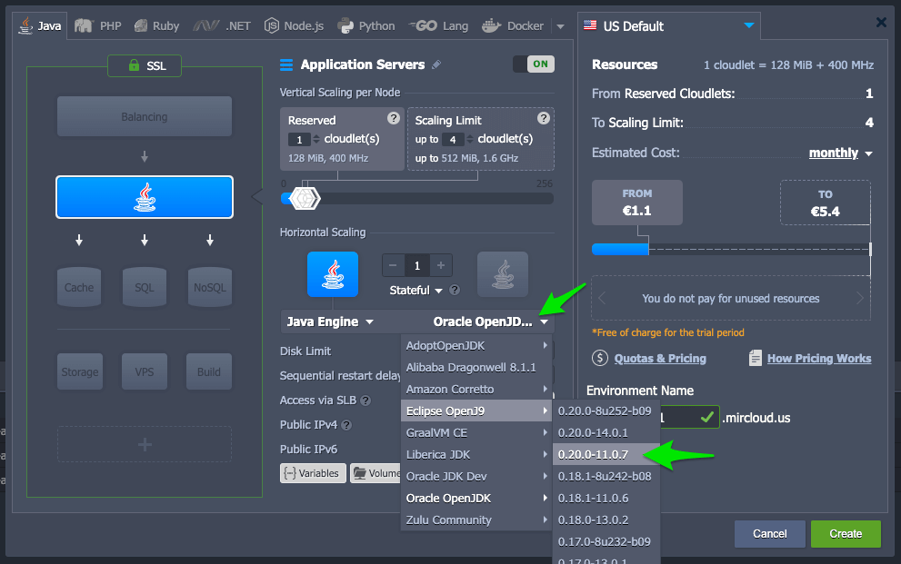
<br>

Set the number of reserved cloudlets to 0, and the scaling limit to 5 cloudlets. You can change these later if you want. Even if you set the scaling limit high, you'll only pay for what you actually use. The first two cloudlets are free, and an app with low load will probably stay below two cloudlets, so hosting hobby apps is free in practice.
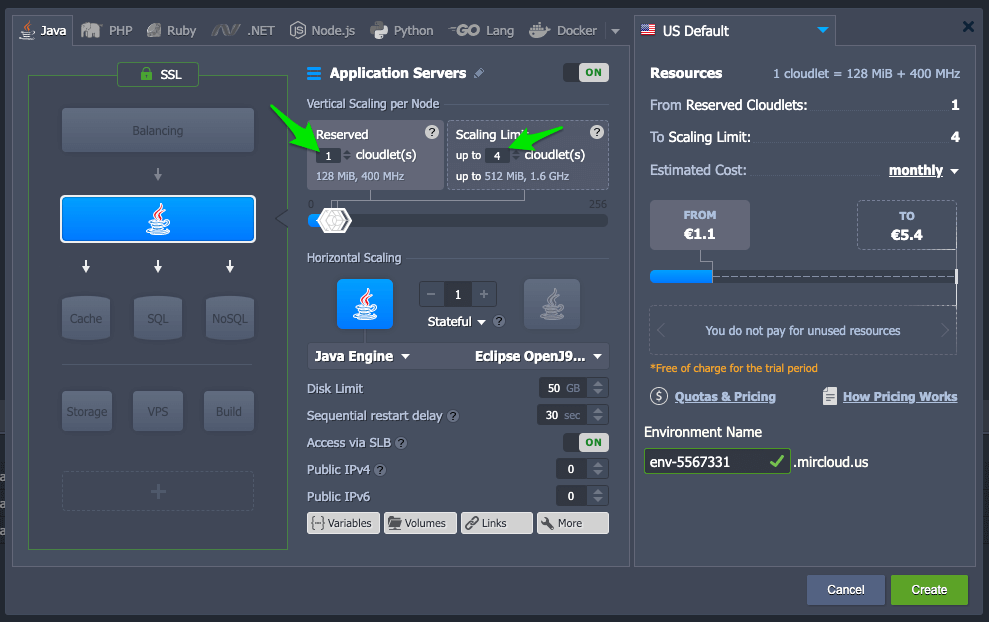
<br>


Click "{...} Variables". This is where we'll set environment variables. 
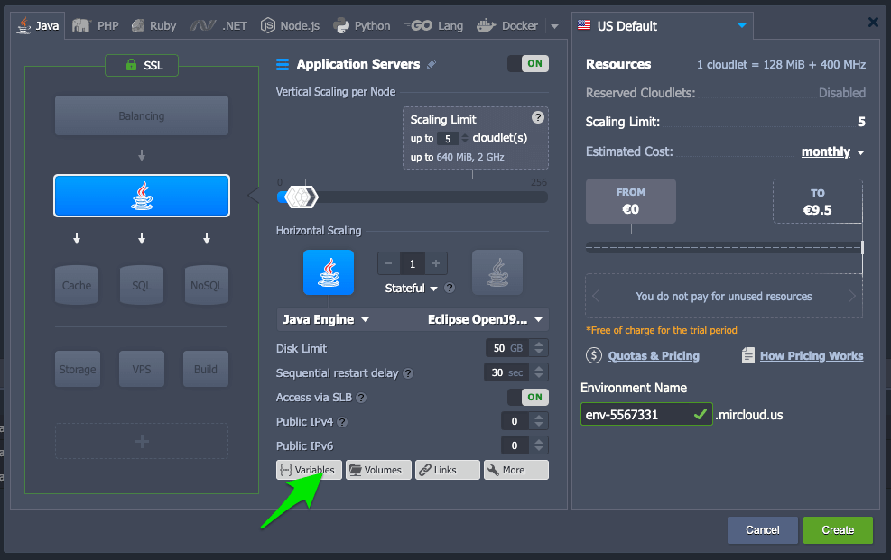
<br>


Add any environment variables that your web app needs. If you're running a Luminus web app you'll need to set the PORT environment variable to 8080. That will [make the Luminus app listen on port 8080](https://luminusweb.com/docs/deployment.html), which is the port that Jelastic will send web requests too. Otherwise a Luminus app would by default listen on port 3000. 

If you want to enable [nREPL support for a Luminus web app](https://luminusweb.com/docs/deployment.html) then also set the NREPL_PORT variable to 7001. 
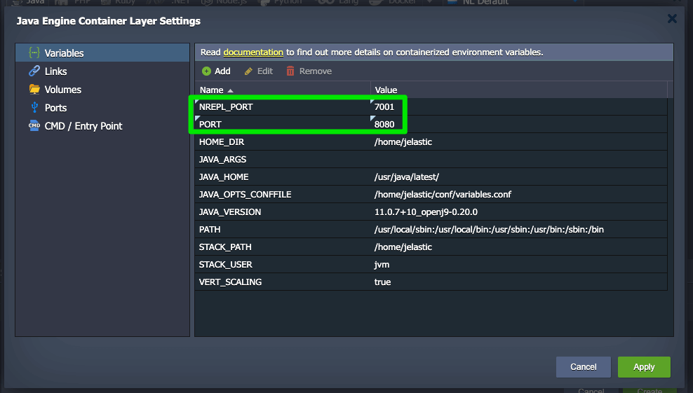
<br>

Choose the datacenter location for your app. It makes sense to choose one close to where your users are. 
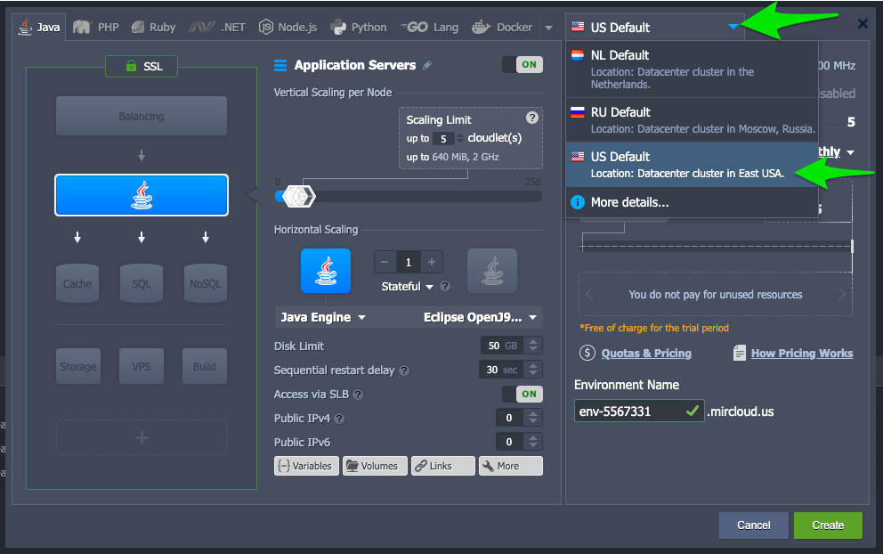
<br>


Enter a name for your environment, then click "Create". It will take 2 minutes or so for the environment to be created.
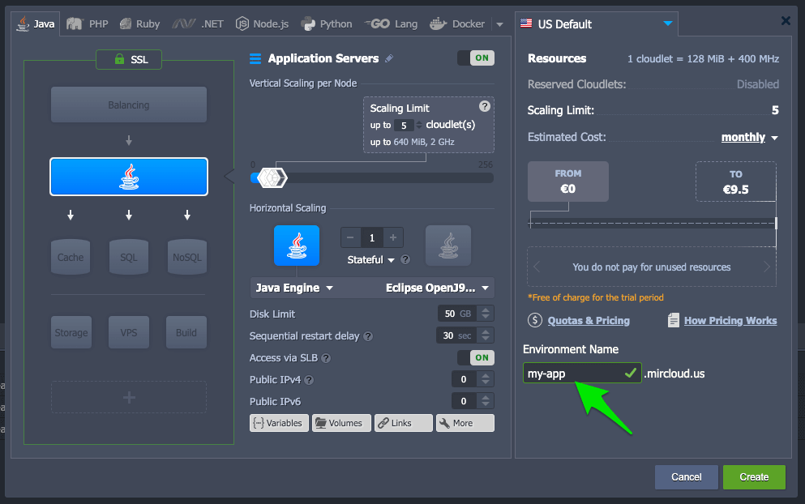
<br>


### Upload your app

Create an uberjar of your web app. If you're using the Luminus template then do this by running `lein uberjar`.

Click the "deploy archive" icon in the environment you created. 
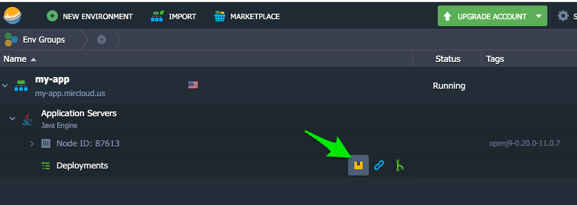
<br>

Choose "Local File", select the uberjar for your web app, and click Deploy.
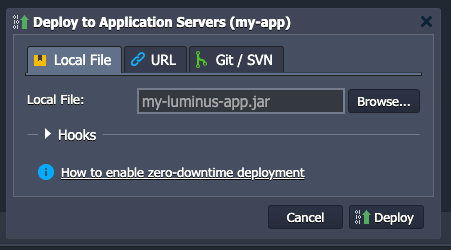
<br>


Once your app has deployed, click the "open in browser" icon to view it live.
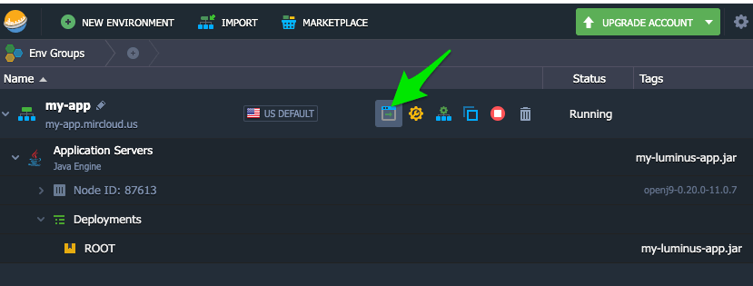
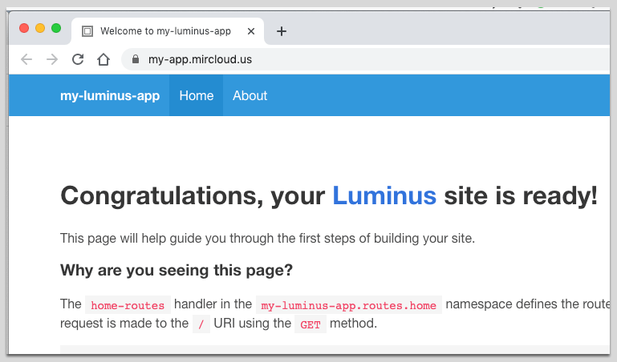


### Checking resource usage

You can see at a glance how many "cloudlets" your app is using from the icon next to the environment. The first two cloudlets are free. 
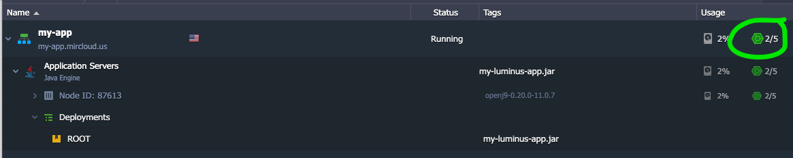
<br>


Click the "statistics" icon to view detailed graphs of RAM, CPU, disk space etc usage. 
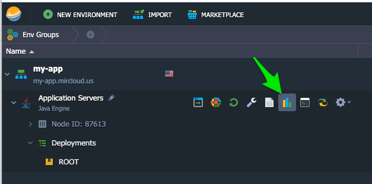
<br>


For low load the RAM usage typically stays at 150-200 MB, which is below the 256 MB 2-cloudlet free limit, meaning that hosting the app is free. 
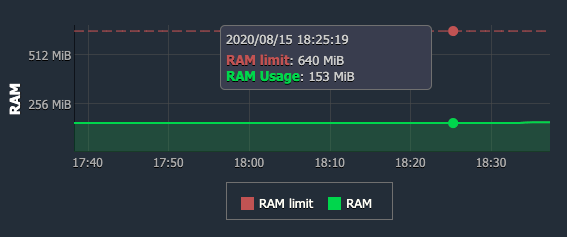


### Changing the server configuration

If you want to change the resource usage limits, environment variables, Java version, or any other details of the configuration, click the "change environment topology" icon next to your environment, and you can change anything you like and re-deploy your app. 

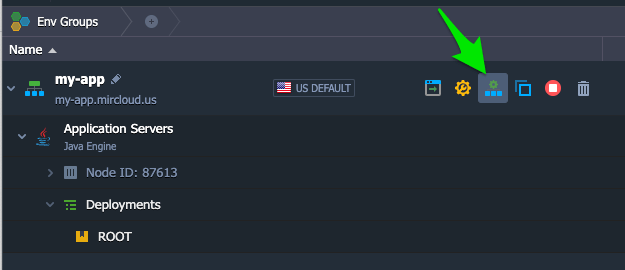


### Automating future deploys

If you deploy frequently you'll want a way to automate deploys rather than using the Jelastic GUI. Luckily [Jelastic has a CLI](https://docs.jelastic.com/cli/) and also you have [ssh access to your Jelastic environment](https://docs.jelastic.com/ssh-access/). Here's a very basic shell-script to automate deployment of a web app, intended to be run from the root directory of a Luminus app. You'll need to change the script's variables to suit your app.


```
#!/bin/bash

# Change to the directory from which the script is being run
cd "$(dirname "$BASH_SOURCE")" || {
    echo "Error getting script directory" >&2
    exit 1
}

JAR_NAME=my-luminus-app.jar
ENV_NAME=my-app
USER_AND_HOST=11111-2222@gate.mircloud.host
NODE_ID=11111

lein uberjar &&\
scp -P 3022  target/uberjar/${JAR_NAME}  ${USER_AND_HOST}:/home/jelastic/APP &&\
~/jelastic/environment/control/restartnodebyid --envname $ENV_NAME --nodeid $NODE_ID
```


### Connecting to a REPL on your live app

To connect to a REPL running on your app you'll need to ssh tunnel (aka ssh port forwarding) into the server. Unfortunately, that's disabled by default in Jelastic. To work around this, you can use an alternative method of port forwarding. See my other post [How to Set Up SSH Port Forwarding (Tunneling) When AllowTcpForwarding is Disabled](https://tobyloxy.com/post/ssh-tunnel-bypass-allowtcpforwarding/).

<br>

## But doesn't it get really expensive, like Heroku?

"I wonder if it could get as expensive as, say, heroku, real quick?" asked someone on [r/Clojure](https://www.reddit.com/r/Clojure/comments/ia63t0/blog_post_how_to_deploy_your_clojure_web_app/). Good question!

The [Jelastic pricing calculator](https://jelastic.com/pay-per-use/#cloud-pricing-calculator) is a little confusing, so to help make things clearer here's an example of an environment that scales up to **1GB RAM and 3.2 GHz CPU**. The price is capped at **$12.50 / mo**, and it's obviously cheaper (or even free) if your app's resource usage is lower than the limits you set.

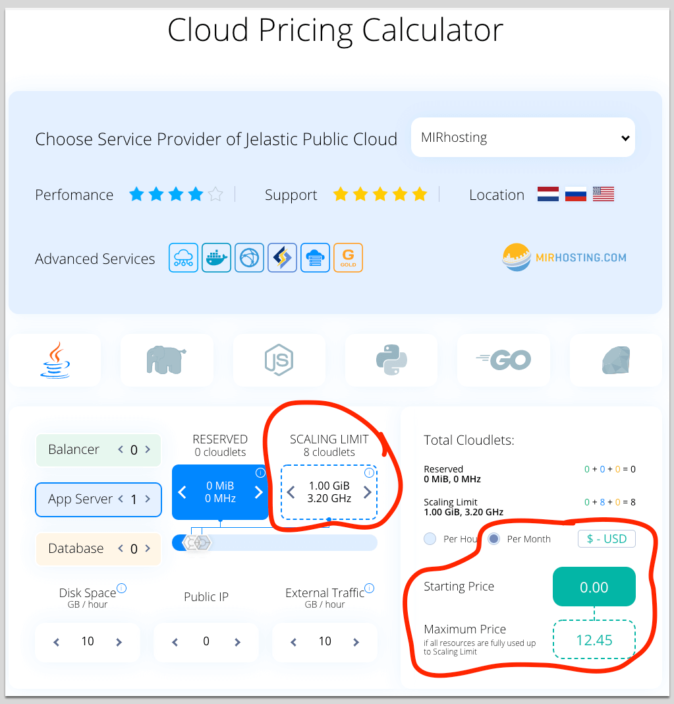
<br>

The equivalent on [Heroku](https://www.heroku.com/pricing) would cost **$50 / mo** regardless of resource usage, I think.
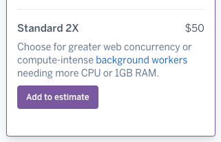
<br>

On Digital Ocean for equivalent RAM you'd pay **$5 / mo** regardless of resource usage:

<br>

In terms of Jelastic vs Digital Ocean pricing, it depends on whether your resource usage is intermittent or continuous, and how close you are to full resource utilisation.

Once you include a bit of a "safety factor" in your server resources, Jelastic & Digital Ocean probably come out about the same price. For instance, if you were consistently using 900 MB of RAM, you'd want the next size up of Digital Ocean droplet (2 GB RAM) to cope with any fluctuations, and that would take the Digital Ocean price to $10 / mo.

<br>


## Alternative approaches

I hope you found my Clojure web app deployment guide helpful. I hope it saved you some time helped you avoid some headaches. If you're looking for other approaches to deploying Clojure apps, then check out

*   [Luminus web framework deployment docs](https://luminusweb.com/docs/deployment.html)
*   [Running Luminus On Dokku](https://yogthos.net/posts/2019-01-19-LuminusOnDokku.html)
*   [Eric Normand's article on JVM Deployment Options (PurelyFunctional.tv)](https://purelyfunctional.tv/article/jvm-deployment-options/)
*   [Deploying Your First Clojure App… From the Shadows (Braveclojure.com)](https://www.braveclojure.com/quests/deploy/)